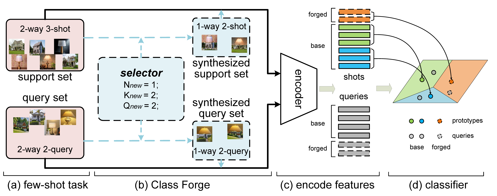

# [ICME2021 Oral] Class Forge: Boosting Feature Encoder for Few-shot Learning with Synthesized Classes




TO RUN:
1. set your data path in "data/CIFAR_FS.py"
2. set your GPUs in ''run_CF.sh''
3. run ''run_CF.sh''

## Citation
```
@inproceedings{
wang2021classforge,
title={Class Forge: Boosting Feature Encoder for Few-shot Learning with Synthesized Classes},
author={Rui-Qi, wang and Xu-Yao, Zhang and Cheng-Lin, Liu},
booktitle={International Conference on Multimedia and Expo},
year={2021}
}
```
## Reference

<https://github.com/gidariss/FewShotWithoutForgetting>